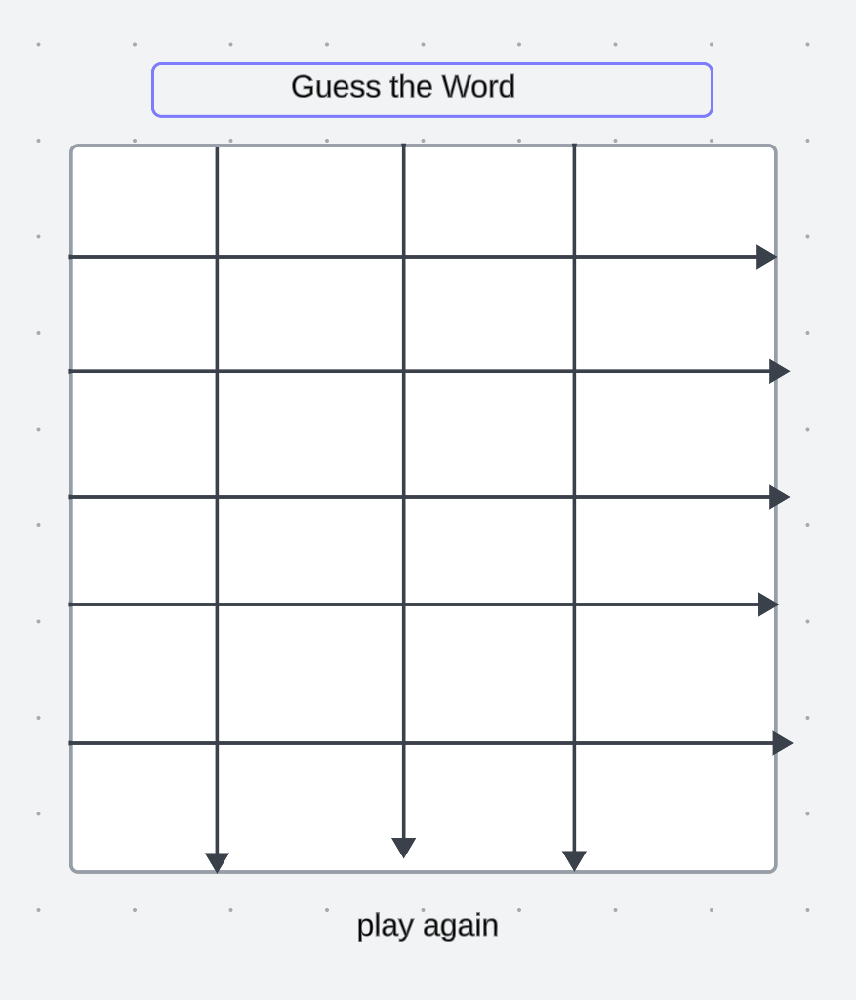

my project name is Wordle, its a word guessing game, i picked this game project because its something i play and enjoy with my daughter, so now i can make one and play with her,

1. initialize the game
   1.1 select random word from the list,
   1.2 reset the game after player has played and let them guess another word

2. show the current state 
   2.1 show the current state with word and underscores and play a feedback message or instruction for player to know the action they need to take to win

3. handle the player's guess
   3.1 get the player input 
   3.2 check if the player's is correct
   3.3 update the current guess with the correct word
   3.4 display the current state and how many wins and losses the player have

4. if the player can not guess the correct word, display don't give up message and give them  a hint

5. display the result at the end
   4.1 if the player's guessed the correct word play congratulations and shake the screen and play flying baloons or change the screen color 

6. user stories 
   As A User I Want To
  6.1 see the  words in clear color
  6.2 know when to reset the game and know if i win or loss
  6.3 see the screen is shaking and congrating for my winnings
  6.4 see line goes true the words that i corrected showing that i guessed the correct word
  6.5 see hint button to click when i am stuck

  # wireframes screenshoot

technologies used 
html
css
javascript

here is my link to the page
https://fartuunh.github.io/Wordle/

